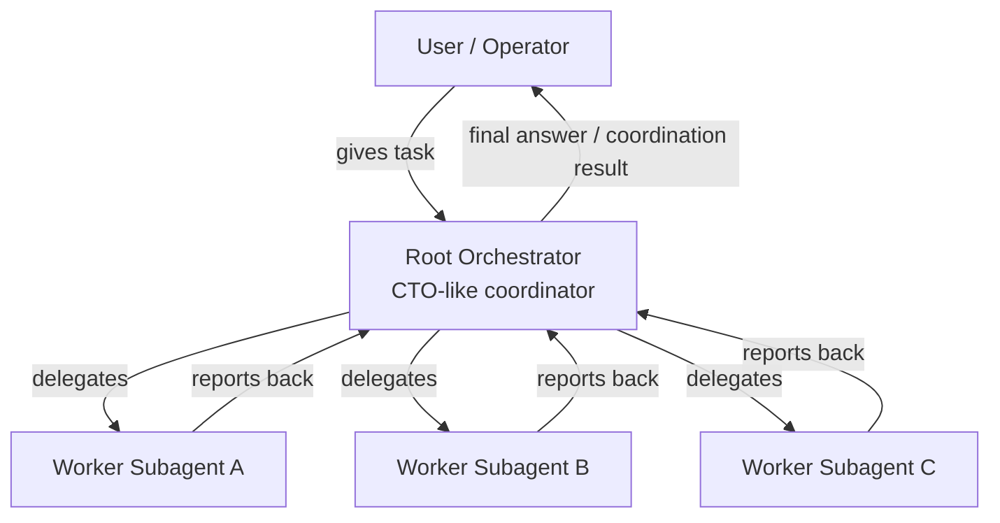
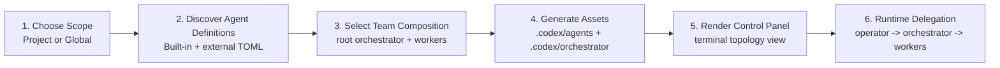

# Understanding And Workflow

## 내가 현재 이해한 제품 방향

- 이 프로젝트의 목적은 단순히 `.codex/agents/*.toml` 파일을 만드는 설치기가 아니다.
- 최종 목적은 프로젝트 로컬 `.codex`를 기준으로 멀티 에이전트 팀을 구성하고 운영하는 control-plane을 만드는 것이다.
- 사용자는 대표 또는 operator로서 루트 orchestrator에게 명령을 내린다.
- orchestrator는 CTO 같은 단일 루트 에이전트로서 하위 subagent들에게 작업을 위임한다.
- control panel은 이 위계가 항상 드러나야 한다.
- 따라서 제품 정체성은 `subagent installer`보다 `orchestrated subagent team builder/control-plane`에 가깝다.

## 현재까지 합의한 핵심 원칙

- 설치 위치는 `Project`와 `Global` 두 가지를 지원한다.
- static agent definition은 `.codex/agents`에 둔다.
- runtime/control-plane 관련 자산은 `.codex/orchestrator`에 둔다.
- agent 정의의 canonical format은 Codex-compatible TOML이어야 한다.
- TOML 구조는 VoltAgent가 사용하는 형태를 강하게 참고하되, 특정 repo 전용 구조로 묶지는 않는다.
- built-in agent뿐 아니라 나중에 사용자가 직접 만든 `.toml` agent도 같은 생태계 안에 추가될 수 있어야 한다.
- 최상단 control panel에는 반드시 root orchestrator가 있어야 한다.

## 현재 구현 상태와 목표 상태

### 현재 구현됨

- `Project` / `Global` scope 선택
- built-in catalog 기반 agent 선택
- 선택한 agent를 `.codex/agents/*.toml`로 생성
- generated agent는 VoltAgent-style Codex-compatible TOML에 가깝게 출력
- project-scope install 시 `.codex/orchestrator` scaffold 생성
- root orchestrator가 들어간 `team.toml` seed 생성
- CLI와 설치용 TUI 제공

### 아직 미구현

- terminal control panel
- `operator/user -> orchestrator -> subagents` 시각화
- 외부 `.toml` agent source를 읽는 구조

## Workflow Diagram



## Product Workflow



## Directory Model

```text
.codex/
├── agents/
│   ├── orchestrator.toml
│   ├── reviewer.toml
│   ├── code-mapper.toml
│   └── ...
└── orchestrator/
    ├── team.toml
    ├── runtime/
    ├── queue/
    ├── ledger/
    └── launchers/
```

## 중요한 드리프트

- 아직 외부 `.toml` agent source를 읽는 discovery 단계는 구현되지 않았다.
- terminal control panel 자체는 아직 없고 현재는 team topology seed까지만 생성한다.
- 따라서 다음 단계는 catalog source를 하드코딩 목록에서 파일 기반 구조로 확장하고, generated team metadata를 panel runtime에 연결하는 것이다.

## 다음 구현 우선순위

1. external `.toml` discovery를 추가한다.
2. generated `team.toml`을 terminal control panel 렌더링에 연결한다.
3. 이후 `tmux` / `cmux` launcher를 붙인다.
