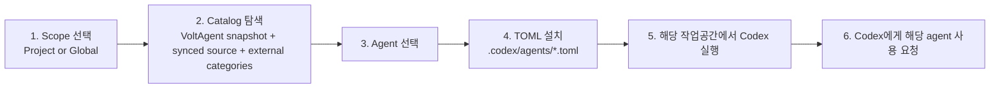
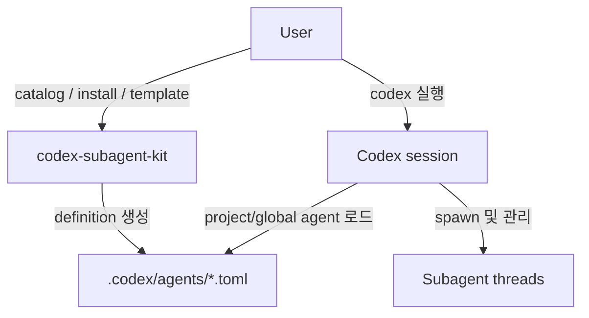

# Understanding And Workflow

영문 기본 문서: [UNDERSTANDING_AND_WORKFLOW.md](./UNDERSTANDING_AND_WORKFLOW.md)

## 현재 제품 이해

- 이 프로젝트의 주된 정체성은 Codex subagent installer이자 catalog manager다
- 핵심 역할은 `.codex/agents/*.toml` 세팅을 쉽고 안전하게 만드는 것이다
- Codex 사용 주변을 돕는 가벼운 session companion으로도 확장될 수 있다
- 하지만 현재 기준으로 Codex 바깥의 standalone orchestration runtime으로 정의하지는 않는다

한 줄로 정리하면:

- `codex-subagent-kit`는 작업공간을 준비하고
- `codex`가 세션을 실행하며
- `codex`가 subagent thread를 spawn하고 관리한다

## 핵심 원칙

- 설치 범위는 `Project`와 `Global` 모두 지원한다
- agent definition은 `.codex/agents`에 둔다
- canonical format은 Codex-compatible TOML이다
- VoltAgent 기반 기본 catalog와 user-injected catalog source를 모두 지원한다
- synced upstream source root와 user-authored injection root를 분리해 둔다
- 사용자가 직접 category / agent template를 만들 수 있어야 한다
- experimental control-plane 작업은 stable core와 명확히 분리한다

## 현재 Stable Commands

- `catalog`
- `catalog sync`
- `catalog import`
- `install`
- `doctor`
- `template init`
- `tui`

이 명령들이 제품의 핵심 가치다.

## 현재 Experimental Commands

- `panel`
- `board`
- `launch`
- `enqueue`
- `dispatch-open`
- `dispatch-prepare`
- `dispatch-begin`
- `apply-result`

이 명령들은 유용한 prototype 또는 companion utility이지만, canonical product workflow는 아니다.

## Main Workflow



## Session Model



## Directory Model

```text
.codex/
└── agents/
    ├── multi-agent-coordinator.toml
    ├── reviewer.toml
    ├── code-mapper.toml
    └── ...
```

선택적으로 `.codex/subagent-kit/` 아래에 experimental companion 자산이 있을 수는 있지만, stable install flow에 필수는 아니다.

stable catalog 보조 자산은 `.codex/subagent-kit/` 아래에 다음처럼 존재할 수 있다.

```text
.codex/subagent-kit/
├── catalog/
│   └── categories/        # user-authored categories / imported TOML
└── sources/
    └── voltagent/
        └── categories/    # synced upstream snapshot overlay
```

## 다음 우선순위

1. 설치되는 TOML에 대한 compatibility validation 강화
2. catalog sync, import, 사용자 작성 template workflow 개선
3. 설치 후 Codex 안에서 어떻게 쓰는지에 대한 권장 usage 문서 강화
