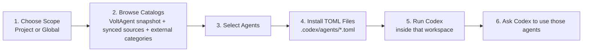
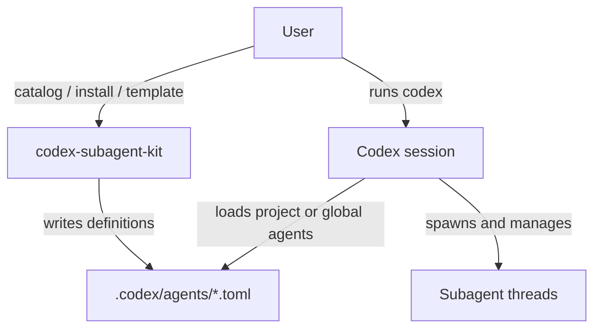

# Understanding And Workflow

Korean version: [UNDERSTANDING_AND_WORKFLOW.ko.md](./UNDERSTANDING_AND_WORKFLOW.ko.md)

## Current Product Understanding

- this project is primarily a Codex subagent installer and catalog manager
- its job is to make `.codex/agents/*.toml` setup easy and safe
- it can also act as a lightweight session companion around Codex usage
- it is not currently defined as a standalone orchestration runtime outside Codex

In short:

- `codex-subagent-kit` prepares the workspace
- `codex` runs the session
- `codex` spawns and manages subagent threads

## Core Principles

- support both `Project` and `Global` install scopes
- keep agent definitions in `.codex/agents`
- use Codex-compatible TOML as the canonical format
- use a VoltAgent-backed default catalog plus user-injected catalog sources
- keep synced upstream source roots separate from user-authored injection roots
- let users author their own category and agent templates
- keep experimental control-plane work clearly separated from the stable core

## Stable Commands Today

- `catalog`
- `catalog sync`
- `catalog import`
- `install`
- `doctor`
- `template init`
- `tui`

These commands define the main product value.

## Experimental Commands Today

- `panel`
- `board`
- `launch`
- `enqueue`
- `dispatch-open`
- `dispatch-prepare`
- `dispatch-begin`
- `apply-result`

These commands are useful prototypes and companion utilities, but they are not the canonical product workflow.

## Main Workflow



## Session Model



## Directory Model

```text
.codex/
└── agents/
    ├── reviewer.toml
    ├── code-mapper.toml
    ├── frontend-owner.toml
    └── ...
```

Optional experimental companion assets may also exist under `.codex/subagent-kit/`, but they are not required for the stable install flow and are only seeded automatically when the selected install set includes a meta-orchestration agent.

Stable catalog companion assets may also exist under `.codex/subagent-kit/`:

```text
.codex/subagent-kit/
├── catalog/
│   └── categories/        # user-authored categories and imported TOML files
└── sources/
    └── voltagent/
        └── categories/    # synced upstream snapshot overlay
```

## Next Priorities

1. improve compatibility validation for installed TOML files
2. improve catalog sync, import, and user-authored template workflows
3. document recommended Codex-side usage patterns after install
