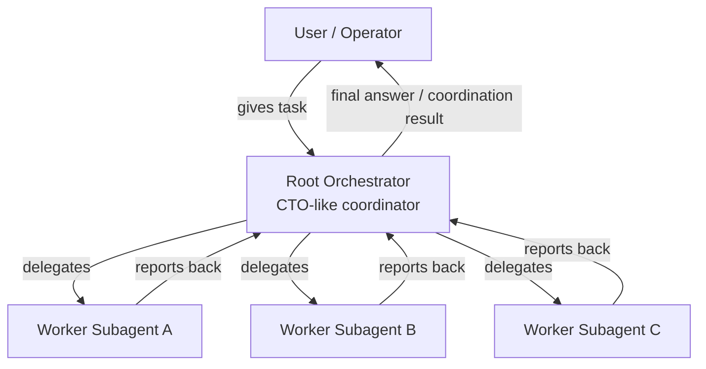
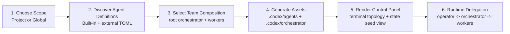

# Understanding And Workflow

Korean version: [UNDERSTANDING_AND_WORKFLOW.ko.md](./UNDERSTANDING_AND_WORKFLOW.ko.md)

## Current Product Understanding

- this project is not just an installer that creates `.codex/agents/*.toml`
- the real goal is to build a control-plane for assembling and operating a multi-agent team inside a project-local `.codex`
- the user acts as the operator and gives instructions to the root orchestrator
- the orchestrator is a single root agent, conceptually similar to a CTO, that delegates work to subagents
- the control panel should always make that hierarchy visible
- the product identity is therefore closer to an `orchestrated subagent team builder/control-plane` than a plain `subagent installer`

## Agreed Core Principles

- support both `Project` and `Global` install scopes
- keep static agent definitions in `.codex/agents`
- keep runtime and control-plane assets in `.codex/orchestrator`
- use Codex-compatible TOML as the canonical agent format
- strongly reference the VoltAgent TOML shape without binding the product to a single external repository
- allow user-authored `.toml` agents to live in the same ecosystem as built-in agents
- always keep a root orchestrator visible at the top of the control panel

## Current vs Target State

### Implemented Today

- `Project` / `Global` scope selection
- built-in plus discovered `.toml` sources for agent selection
- generation of selected agents into `.codex/agents/*.toml`
- generated agents close to VoltAgent-style Codex-compatible TOML
- project-scope `.codex/orchestrator` scaffold generation
- `team.toml` seed with a root orchestrator
- runtime, queue, and dispatch ledger seeds
- `panel` command for topology plus seeded runtime summary
- `board` command for role-specific terminal boards
- `enqueue` command for operator queue submission
- `dispatch-open` command for queue-to-ledger promotion
- `dispatch-prepare` command for ready dispatch handoff rendering
- `dispatch-begin` command for in-flight `dispatched` state transition
- `apply-result` command for writing dispatch outcomes back to queue, ledger, and runtime
- project-local launcher seed generation
- `launch` command for generated `tmux` / `cmux` launchers, including dry-run
- CLI and install-focused TUI

### Still Missing

- a live runtime-aware terminal control panel
- actual `spawn_agent` / `send_input` / `wait_agent` integration
- live queue drain and pane/session status sync

## Workflow Diagram



## Product Workflow



## Directory Model

```text
.codex/
├── agents/
│   ├── orchestrator.toml
│   ├── reviewer.toml
│   ├── code-mapper.toml
│   └── ...
└── orchestrator/
    ├── team.toml
    ├── runtime/
    ├── queue/
    ├── ledger/
    └── launchers/
```

## Current Drift to Watch

- the terminal control panel still stops at a seed-file summary layer; it is not yet a live runtime or queue-draining system
- built-in sources still live in Python code rather than a packaged TOML library
- the next meaningful step is to connect generated team metadata to real runtime behavior and, if needed, move built-in sources into a file-based catalog

## Next Priorities

1. connect actual `send_input` / `wait_agent` integration through a thin slice
2. if useful, migrate built-in sources into a portable file-based catalog
